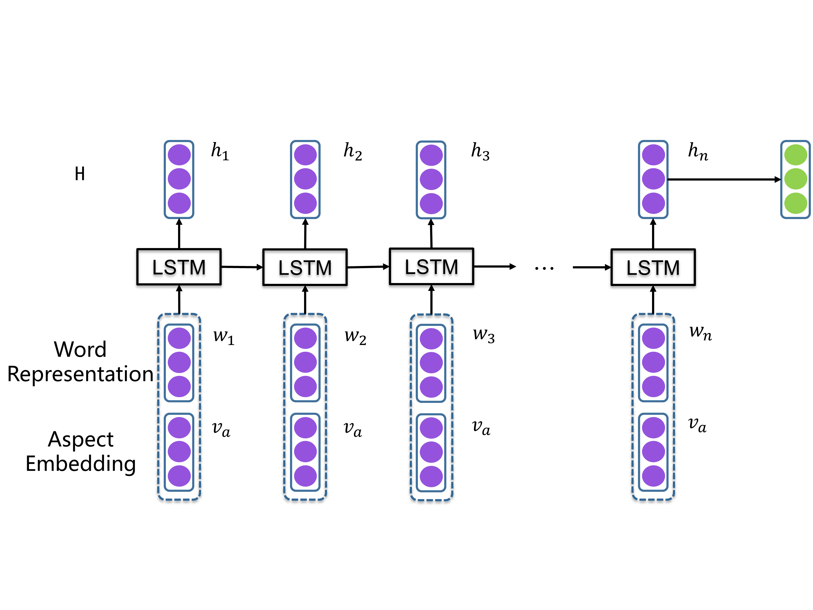
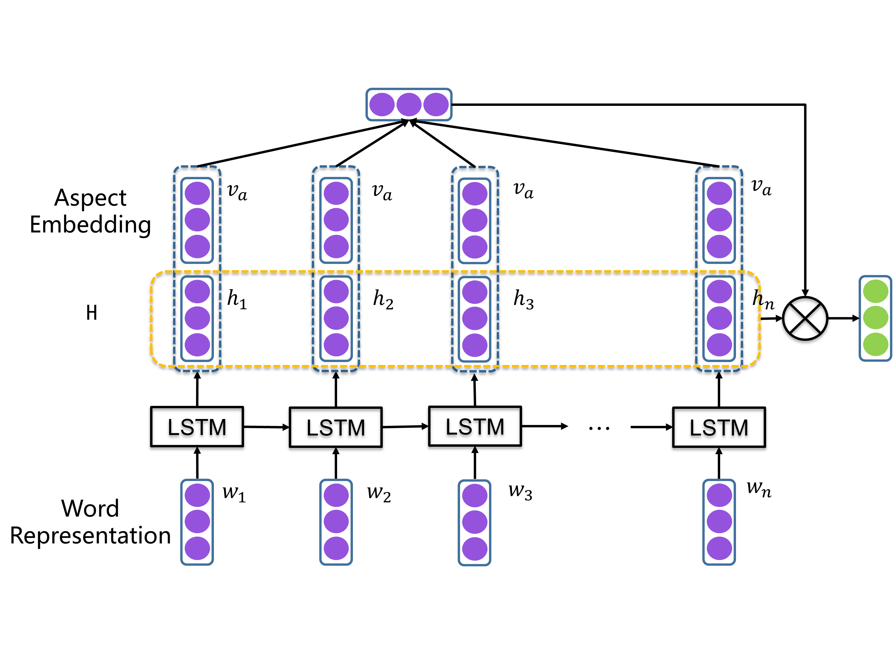
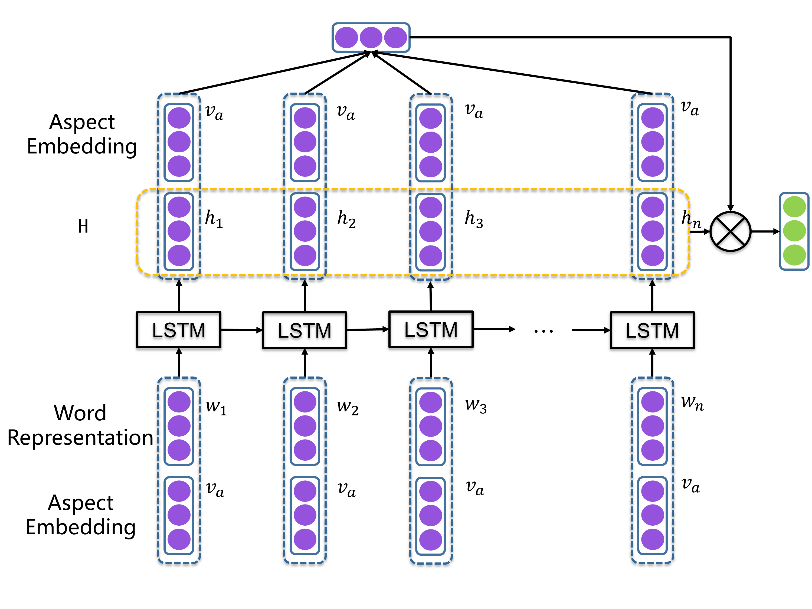
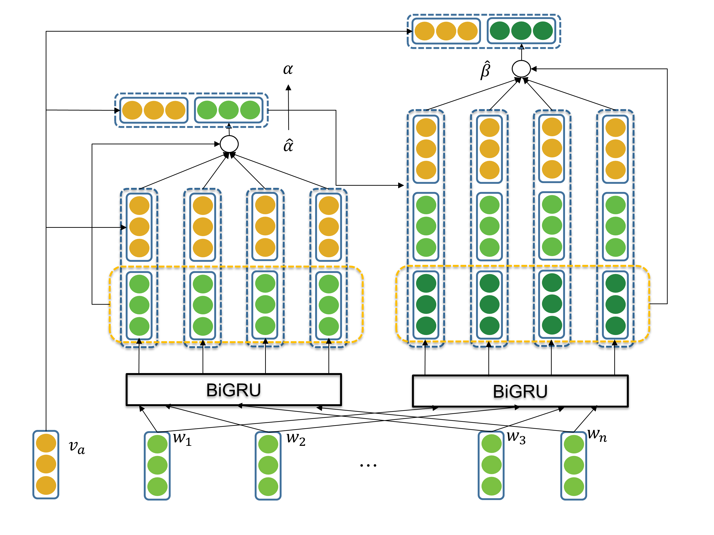

# ACSA
> Papers, models and datasets for Aspect-Category Sentiment Analysis, which contains two fine-grained subtasks: Aspect Category Detection (ACD) and Aspect Category Sentiment Classification (ACSC).

## Requirement
* python 3.6
* pytorch 1.3.0
* allennlp 0.9.0

## Usage

### Supported datasets
- [SemEval-2014 Task 4](http://alt.qcri.org/semeval2014/task4/)
    - SemEval-2014-Task-4-LAPT
    - SemEval-2014-Task-4-REST
- [2018-aaai-Learning to Attend via Word-Aspect Associative Fusion for Aspect-based Sentiment Analysis](https://arxiv.org/abs/1712.05403v1)
    - SemEval-2014-Task-4-REST-DevSplits
- [2018-acl-Aspect Based Sentiment Analysis with Gated Convolutional Networks](https://arxiv.org/abs/1805.07043)
    - SemEval-2014-Task-4-REST-Hard
    - SemEval-141516-LARGE-REST-HARD
- [SemEval-2015 Task 12](http://alt.qcri.org/semeval2015/task12/)
    - SemEval-2015-Task-12-LAPT
    - SemEval-2015-Task-12-REST
    - SemEval-2015-Task-12-HOTEL
- [SemEval-2016 Task 5](http://alt.qcri.org/semeval2016/task5/)
    - SemEval-2016-Task-5-CH-CAME-SB1
    - SemEval-2016-Task-5-CH-PHNS-SB1
    - SemEval-2016-Task-5-LAPT-SB1
    - SemEval-2016-Task-5-LAPT-SB2
    - SemEval-2016-Task-5-REST-SB1
    - SemEval-2016-Task-5-REST-SB2
- [2019-emnlp-A Challenge Dataset and Effective Models for Aspect Based Sentiment Analysis](https://www.aclweb.org/anthology/D19-1654.pdf)
    - MAMSACSA
    - MAMSATSA

### Aspect-Category Sentiment Classification (ACSC) Models
#### Supported models
- ae-lstm [2016-emnlp-Attention-based LSTM for Aspect-level Sentiment Classification](https://www.aclweb.org/anthology/D16-1058.pdf)

- at-lstm [2016-emnlp-Attention-based LSTM for Aspect-level Sentiment Classification](https://www.aclweb.org/anthology/D16-1058.pdf)

- atae-lstm [2016-emnlp-Attention-based LSTM for Aspect-level Sentiment Classification](https://www.aclweb.org/anthology/D16-1058.pdf)

- Heat(papers/2017-CIKM-Aspect-level Sentiment Classification with HEAT (HiErarchical ATtention) Network.pdf)

#### Training
sh scripts/run.sh acsa/acac_pytorch/acsc_bootstrap.py --model_name Heat --current_dataset SemEval-2014-Task-4-REST-DevSplits --embedding_filepath glove.840B.300d.txt

#### Visualization
sh scripts/run.sh acsa/acac_pytorch/acsc_bootstrap.py --model_name Heat --current_dataset SemEval-2014-Task-4-REST-DevSplits --embedding_filepath glove.840B.300d.txt --train False --visualize_attention True

### Aspect Category Detection (ACD) Models

### Joint Models for ACSC and ACD

## Paper
Suggestions about adding papers are welcomed!

### Aspect-Category Sentiment Classification (ACSC)
- 2016-emnlp-A Hierarchical Model of Reviews for Aspect-based Sentiment Analysis [paper](papers/2016-emnlp-A%20Hierarchical%20Model%20of%20Reviews%20for%20Aspect-based%20Sentiment%20Analysis.pdf)
- 2016-emnlp-Attention-based LSTM for Aspect-level Sentiment Classification [paper](papers/2016-emnlp-Attention-based%20LSTM%20for%20Aspect-level%20Sentiment%20Classification.pdf)
- 2017-CIKM-Aspect-level Sentiment Classification with HEAT (HiErarchical ATtention) Network [paper](papers/2017-CIKM-Aspect-level%20Sentiment%20Classification%20with%20HEAT%20(HiErarchical%20ATtention)%20Network.pdf)
- 2018-aaai-Learning to Attend via Word-Aspect Associative Fusion for Aspect-based Sentiment Analysis [paper](papers/2018-aaai-Learning%20to%20Attend%20via%20Word-Aspect%20Associative%20Fusion%20for%20Aspect-based%20Sentiment%20Analysis.pdf)
- 2018-acl-Aspect Based Sentiment Analysis with Gated Convolutional Networks [paper](papers/2018-acl-Aspect%20Based%20Sentiment%20Analysis%20with%20Gated%20Convolutional%20Networks.pdf)
- 2019-AAAI-A Human-Like Semantic Cognition Network for Aspect-Level Sentiment Classification [paper](papers/2019-AAAI-A%20Human-Like%20Semantic%20Cognition%20Network%20for%20Aspect-Level%20Sentiment%20Classification.pdf)
- 2019-conll-Learning to Detect Opinion Snippet for Aspect-Based Sentiment Analysis [paper](papers/2019-conll-Learning%20to%20Detect%20Opinion%20Snippet%20for%20Aspect-Based%20Sentiment%20Analysis.pdf)
- 2019-emnlp-A Challenge Dataset and Effective Models for Aspect Based Sentiment Analysis [paper](papers/2019-emnlp-A%20Challenge%20Dataset%20and%20Effective%20Models%20for%20Aspect%20Based%20Sentiment%20Analysis.pdf)
- 2019-emnlp-A Novel Aspect-Guided Deep Transition Model for Aspect Based Sentiment Analysis [paper](papers/2019-emnlp-A%20Novel%20Aspect-Guided%20Deep%20Transition%20Model%20for%20Aspect%20Based%20Sentiment%20Analysis.pdf)
- 2019-ijcai-Earlier Attention Aspect-Aware LSTM for Aspect Sentiment Analysis [paper](papers/2019-ijcai-Earlier%20Attention%20Aspect-Aware%20LSTM%20for%20Aspect%20Sentiment%20Analysis.pdf)
- 2019-naacl-Utilizing BERT for Aspect-Based Sentiment Analysis via Constructing Auxiliary Sentence [paper](papers/2019-naacl-Utilizing%20BERT%20for%20Aspect-Based%20Sentiment%20Analysis%20via%20Constructing%20Auxiliary%20Sentence.pdf)
- 2019-tkdd-Aspect Aware Learning for Aspect Category Sentiment Analysis [paper](papers/2019-tkdd-Aspect%20Aware%20Learning%20for%20Aspect%20Category%20Sentiment%20Analysis.pdf)

### joint models
- 2017-wsdm-Deep Memory Networks for Attitude Identification [paper](papers/2017-wsdm-Deep%20Memory%20Networks%20for%20Attitude%20Identification.pdf)
- 2018-emnlp-Joint Aspect and Polarity Classification for Adpect-based Sentiment Analysis with End-to-End Neural Networks [paper](papers/2018-Joint%20Aspect%20and%20Polarity%20Classification%20for%20Adpect-based%20Sentiment%20Analysis%20with%20End-to-End%20Neural%20Networks.pdf)
- 2019-www-Aspect-level Sentiment Analysis using AS-Capsules [paper](papers/2019-www-Aspect-level%20Sentiment%20Analysis%20using%20AS-Capsules.pdf)
- 2019-emnlp-CAN Constrained Attention Networks for Multi-Aspect Sentiment Analysis [paper](papers/2019-emnlp-CAN%20Constrained%20Attention%20Networks%20for%20Multi-Aspect%20Sentiment%20Analysis.pdf)

## Related Repositories
- [songyouwei/ABSA-PyTorch](https://github.com/songyouwei/ABSA-PyTorch)
- [ZhengZixiang/ABSAPapers](https://github.com/ZhengZixiang/ABSAPapers)
- [jiangqn/Aspect-Based-Sentiment-Analysis](https://github.com/jiangqn/Aspect-Based-Sentiment-Analysis)

## Contributions

Feel free to contribute!

You can raise an issue or submit a pull request, whichever is more convenient for you.

## Licence

MIT License