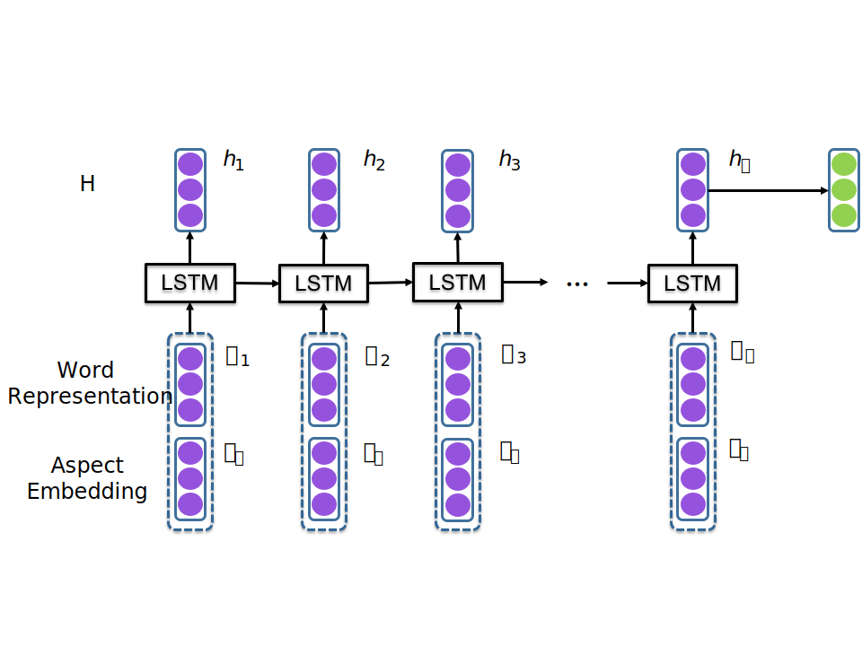
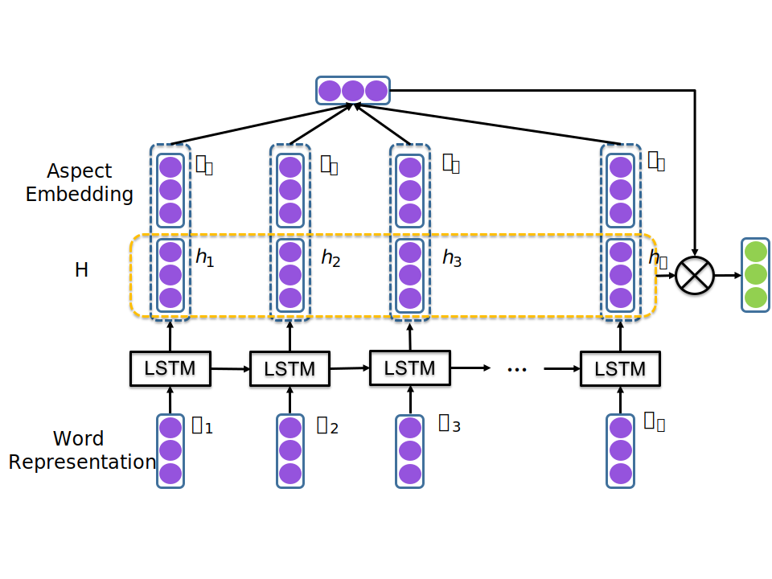
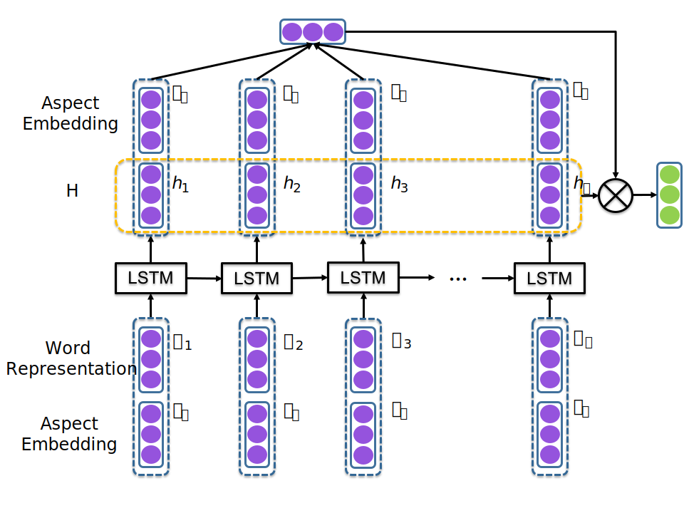

# ACSA
> Papers, models and datasets for Aspect-Category Sentiment Analysis.

## Requirement
* python 3.6
* pytorch 1.3.0
* allennlp 0.9.0

## Usage
### Aspect-Category Sentiment Classification Models
#### Supported models
- [ae-lstm](https://www.aclweb.org/anthology/D16-1058.pdf)

- [at-lstm](https://www.aclweb.org/anthology/D16-1058.pdf)

- [atae-lstm](https://www.aclweb.org/anthology/D16-1058.pdf)

- Heat(papers/2017-CIKM-Aspect-level Sentiment Classification with HEAT (HiErarchical ATtention) Network.pdf)

#### Training
sh scripts/run.sh acsa/acac_pytorch/acsc_bootstrap.py --model_name Heat --embedding_filepath glove.840B.300d.txt

#### visualization
sh scripts/run.sh acsa/acac_pytorch/acsc_bootstrap.py --model_name Heat --embedding_filepath glove.840B.300d.txt --train False --visualize_attention True

## Contributions

Feel free to contribute!

You can raise an issue or submit a pull request, whichever is more convenient for you.

## Licence

MIT License